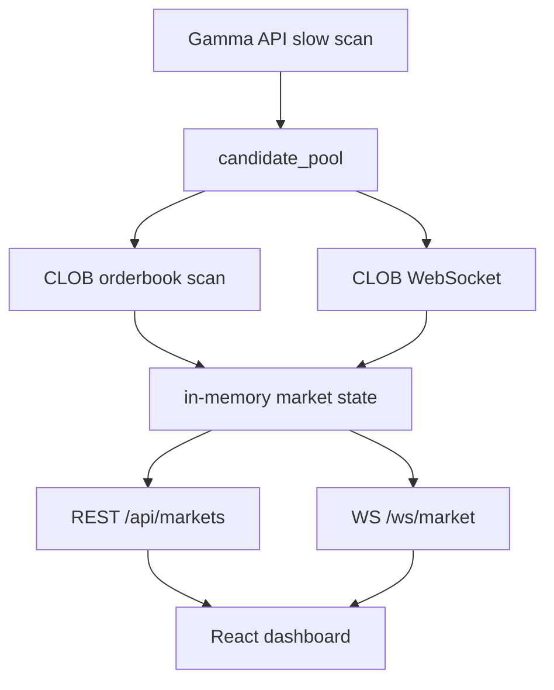

# EdgeRadar

> Polymarket event-market intelligence dashboard. Gamma discovers markets; CLOB validates tradable prices.

EdgeRadar 是一个面向事件交易研究的开源监控台。它不是自动下单机器人，而是帮助你把 Polymarket 的市场价格、CLOB 真实盘口、剩余时间、流动性和风险信号放到同一张决策表里。

当前代码内部仍使用 `PolyMonitor` 作为服务名，避免影响本地运行；GitHub 对外项目名建议使用 `EdgeRadar`，更适合传播和搜索。

## 为什么值得关注

- `Gamma != tradable price`：Gamma API 适合发现市场，但不能作为最终交易价格。
- `CLOB first`：机会排序、评分和提醒以 CLOB best bid / best ask / spread / last trade 为主。
- `Time-aware`：不同市场的时间解释不同，体育、天气、By Date、选举和统计周期不能统一看 `endDate`。
- `Human-in-the-loop`：默认只做扫描、提醒、分析和记录，不自动下单。
- `Resource-safe`：扫描默认可暂停，适合本地机器和老 MacBook 长期运行。

## 功能概览

- Gamma API 慢扫：发现 2 天内、高概率、有流动性的候选市场。
- CLOB 精扫：使用 orderbook 和 last trade 校验真实可交易概率。
- WebSocket 推送：前端通过 `/ws/market` 接收市场快照、价格更新和连接状态。
- 分泳道展示：短线高频、体育临场、电竞临场、常规事件。
- 关键列：Gamma%、CLOB%、偏差、30s/3m 变化、spread、last trade、流动性、时间、评分。
- 扫描总开关：前端可暂停后台 Gamma/CLOB 扫描，避免无意义流量。
- macOS launchd、本地开发、Docker 开发、Linux 生产部署文档已准备。

## 截图

当前仓库未内置截图资源。发布 GitHub 前建议添加一张真实运行截图到：

```text
docs/assets/edgeradar-dashboard.png
```

然后在这里引用：

```md

```

## 快速开始

### 1. 后端

```bash
cd backend
python3 -m venv .venv
source .venv/bin/activate
pip install -r requirements.txt
cp .env.example .env
uvicorn app.main:app --reload --host 127.0.0.1 --port 8000
```

健康检查：

```bash
curl http://127.0.0.1:8000/api/health
curl http://127.0.0.1:8000/api/status
```

### 2. 前端

```bash
cd frontend
npm install
cp .env.example .env
npm run dev
```

打开：

```text
http://127.0.0.1:5173
```

### 3. 本机常驻页面服务 macOS

如果只想保证页面和 API 能随时打开，但不想默认扫描：

```bash
./scripts/ensure_local_services.sh
```

默认扫描开关由 `backend/.env` 控制：

```bash
SCANNING_ENABLED_DEFAULT=false
```

页面打开后，可以在前端手动点击“开始扫描”。

## Docker 开发

```bash
cp backend/.env.docker.example backend/.env.docker
cp frontend/.env.docker.example frontend/.env.docker
docker compose -f docker-compose.dev.yml up -d --build
```

访问：

```text
http://127.0.0.1:5173
```

这套 Compose 是开发模式，源码 bind mount，适合远程二次开发。公网生产部署请看 [docs/DEPLOYMENT.md](docs/DEPLOYMENT.md)。

## API

- `GET /api/health`：健康检查。
- `GET /api/status`：扫描状态、连接状态、最近完成时间。
- `POST /api/scanner`：开启或暂停后台扫描。
- `GET /api/markets`：当前市场列表。
- `GET /api/events`：近期推送事件。
- `WS /ws/market`：实时市场和价格推送。

## 核心架构



## 风险声明

- 本项目不是投资建议。
- 本项目不提供自动交易功能。
- 高概率不等于正期望；必须考虑 spread、流动性、盘口新鲜度、滑点和市场关闭风险。
- Polymarket 页面显示值、Gamma 字段和 CLOB 可交易盘口可能不同。
- 体育和天气等市场需要外部真实数据源进一步校验，当前版本仍以市场数据为主。

## 发布关键词

适合 GitHub Topics：

```text
polymarket prediction-markets event-markets trading-dashboard clob websocket fastapi react market-intelligence
```

## 文档

- [系统架构](docs/architecture.md)
- [策略研究记录](docs/STRATEGY_RESEARCH.md)
- [开发工作流](docs/DEVELOPMENT_WORKFLOW.md)
- [Linux 生产部署](docs/DEPLOYMENT.md)
- [远程 Docker 开发](docs/REMOTE_DOCKER_DEV.md)
- [GitHub 发布与传播计划](docs/GITHUB_RELEASE_PLAN.md)

## 许可证

MIT License。详见 [LICENSE](LICENSE)。
