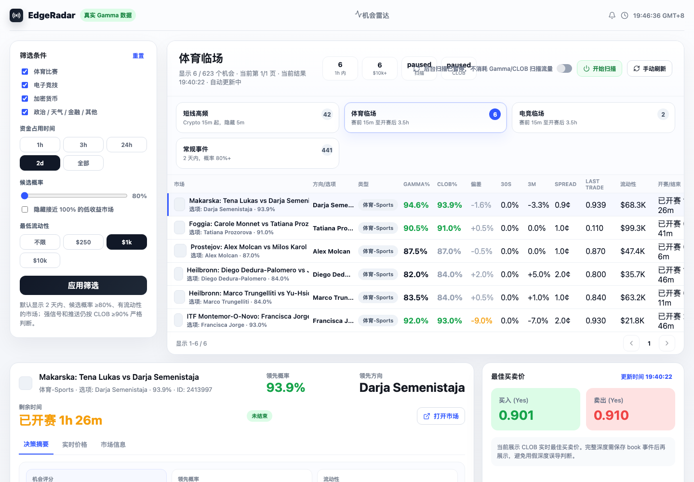
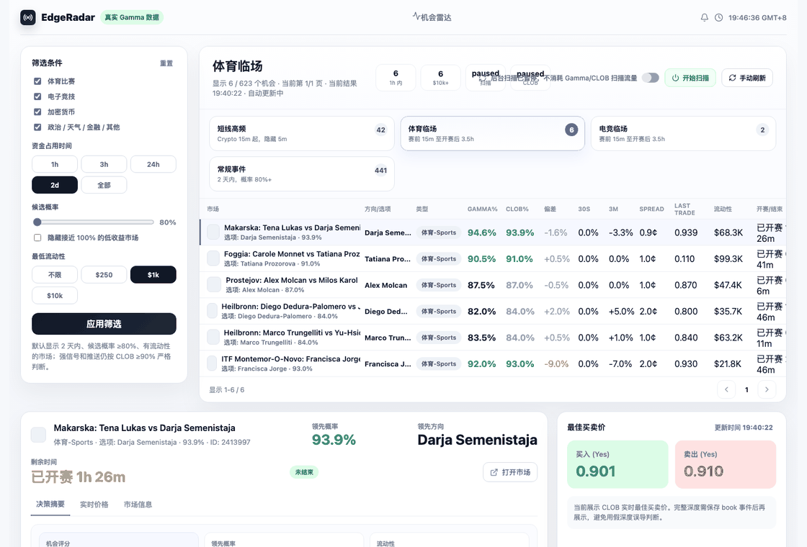
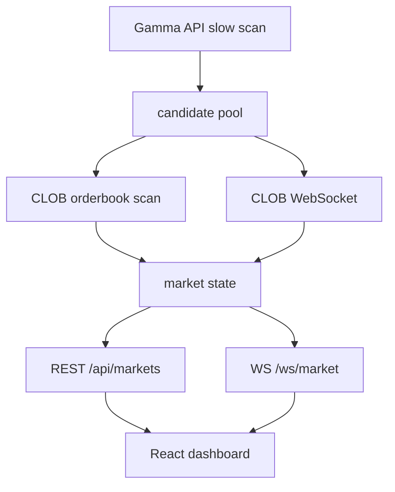

# EdgeRadar

> CLOB-first Polymarket intelligence dashboard for event-market research.

[中文](#中文) | [English](#english)





## English

EdgeRadar is an open-source event-market intelligence dashboard. It is not an auto-trading bot. It helps researchers and discretionary traders compare Polymarket discovery data with real CLOB tradable prices, liquidity, spread, price freshness, time risk, and market status.

The codebase still keeps some internal `PolyMonitor` service names for local compatibility, while the public project name is **EdgeRadar**.

### Why It Exists

- **Gamma is discovery, not execution**: Gamma API is useful for finding markets, but its prices can lag.
- **CLOB-first scoring**: Opportunity ranking uses CLOB best bid / best ask / spread / last trade whenever available.
- **Time-aware market logic**: Sports, crypto, weather, elections, By Date rules, and inclusive date ranges need different deadline interpretation.
- **Human-in-the-loop**: The system is for scanning, monitoring, research, and alerts. It does not place orders.
- **Resource-safe**: Background scanning can be paused from the UI and is disabled by default in local examples.

### Features

- Gamma slow scan for market discovery.
- CLOB orderbook scan for tradable prices.
- WebSocket updates from backend to frontend.
- Lane-based UI: short-term crypto, live sports, live esports, regular events.
- Columns for Gamma%, CLOB%, deviation, 30s/3m movement, spread, last trade, liquidity, deadline, and score.
- Frontend scanner switch to pause Gamma/CLOB traffic.
- Local macOS launchd service, Docker dev setup, and Linux production deployment docs.

### Quick Start

Backend:

```bash
cd backend
python3 -m venv .venv
source .venv/bin/activate
pip install -r requirements.txt
cp .env.example .env
uvicorn app.main:app --reload --host 127.0.0.1 --port 8000
```

Frontend:

```bash
cd frontend
npm install
cp .env.example .env
npm run dev
```

Open:

```text
http://127.0.0.1:5173
```

Docker dev:

```bash
cp backend/.env.docker.example backend/.env.docker
cp frontend/.env.docker.example frontend/.env.docker
docker compose -f docker-compose.dev.yml up -d --build
```

### API

- `GET /api/health`
- `GET /api/status`
- `POST /api/scanner`
- `GET /api/markets`
- `GET /api/events`
- `WS /ws/market`

### Architecture



### Risk Disclaimer

This project is not financial advice. High probability is not automatically positive expected value. You still need to account for spread, liquidity, slippage, stale books, market closure risk, and external real-world data.

## 中文

EdgeRadar 是一个开源事件市场机会雷达。它不是自动交易机器人，而是帮助研究者和人工交易者把 Polymarket 的市场发现数据、CLOB 真实可交易盘口、流动性、spread、盘口新鲜度、时间风险和市场状态放到同一张决策表里。

为了不破坏本地运行，代码里仍保留部分 `PolyMonitor` 服务名；对外发布项目名使用 **EdgeRadar**。

### 为什么做这个项目

- **Gamma 负责发现，不负责最终交易判断**：Gamma API 价格可能滞后。
- **CLOB 优先**：机会排序优先使用 CLOB best bid / best ask / spread / last trade。
- **按市场类型解释时间**：体育、加密、天气、选举、By Date、统计周期市场不能统一看 `endDate`。
- **人工决策优先**：系统只做扫描、监控、研究和提醒，不自动下单。
- **可控资源消耗**：前端可以暂停后台扫描，本地样例默认不自动扫描。

### 已实现功能

- Gamma 慢扫发现市场。
- CLOB orderbook 精扫校验真实可交易价格。
- 后端 WebSocket 推送到前端。
- 分泳道展示：短线高频、体育临场、电竞临场、常规事件。
- 展示 Gamma%、CLOB%、偏差、30s/3m 变化、spread、last trade、流动性、时间和评分。
- 前端扫描总开关，避免无意义消耗 Gamma/CLOB 流量。
- 支持本地 macOS launchd、Docker 开发和 Linux 生产部署。

### 快速开始

后端：

```bash
cd backend
python3 -m venv .venv
source .venv/bin/activate
pip install -r requirements.txt
cp .env.example .env
uvicorn app.main:app --reload --host 127.0.0.1 --port 8000
```

前端：

```bash
cd frontend
npm install
cp .env.example .env
npm run dev
```

打开：

```text
http://127.0.0.1:5173
```

本机常驻页面服务：

```bash
./scripts/ensure_local_services.sh
```

默认扫描开关由 `backend/.env` 控制：

```bash
SCANNING_ENABLED_DEFAULT=false
```

页面打开后，可以在前端手动点击“开始扫描”。

### Docker 开发

```bash
cp backend/.env.docker.example backend/.env.docker
cp frontend/.env.docker.example frontend/.env.docker
docker compose -f docker-compose.dev.yml up -d --build
```

### 文档

- [系统架构](docs/architecture.md)
- [策略研究记录](docs/STRATEGY_RESEARCH.md)
- [开发工作流](docs/DEVELOPMENT_WORKFLOW.md)
- [Linux 生产部署](docs/DEPLOYMENT.md)
- [远程 Docker 开发](docs/REMOTE_DOCKER_DEV.md)
- [GitHub 发布与传播计划](docs/GITHUB_RELEASE_PLAN.md)

### 风险声明

本项目不是投资建议，也不提供自动下单功能。高概率不等于正期望；仍然必须考虑 spread、流动性、盘口新鲜度、滑点、市场关闭风险和外部真实世界数据。

## GitHub Topics

```text
polymarket prediction-markets event-markets trading-dashboard clob websocket fastapi react market-intelligence
```

## License

MIT License. See [LICENSE](LICENSE).
