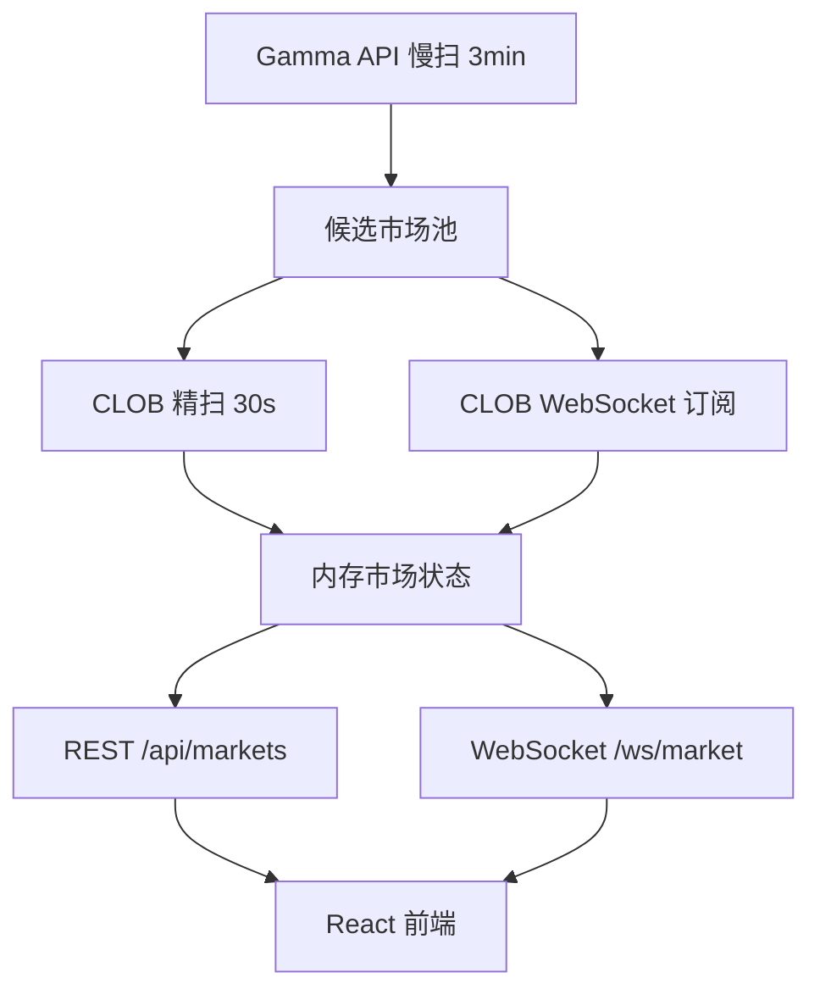

# 系统架构

## 当前定位

PolyMonitor 是事件交易机会雷达，不是 Polymarket 全站浏览器。当前重点是用 Gamma 发现市场，用 CLOB 校验真实盘口，再通过前端辅助人工决策。

## 模块职责

1. 市场数据模块：Gamma API 慢扫市场和事件。
2. 实时状态模块：CLOB WebSocket 订阅和 CLOB orderbook 精扫。
3. 数据清洗模块：市场归类、衍生市场过滤、时间解释。
4. 策略模型模块：根据 CLOB 概率、流动性、spread、时间和盘口新鲜度评分。
5. 前端展示模块：按短线高频、体育临场、电竞临场、常规事件分泳道展示。
6. 外部数据源模块：尚未接入，后续用于比分、天气、新闻、社媒、链上等真实世界状态校验。
7. 日志与复盘模块：当前尚未完善。
8. 回测模块：当前尚未实现。

## 当前数据流

## API 结构

1. `GET /api/markets`：返回当前筛选后的市场状态。
2. `GET /api/status`：返回后台扫描和连接状态。
3. `POST /api/scanner`：开启或暂停后台 Gamma/CLOB 扫描。
4. `WS /ws/market`：推送市场快照、市场更新、价格更新和连接状态。

## 数据结构

当前使用内存状态，核心模型为 `MonitorMarket`。后续需要引入本地数据库保存 orderbook、价格历史、候选池变更和策略信号。

## 部署形态

1. 本地开发：FastAPI + Vite。
2. Docker 开发：`docker-compose.dev.yml`，源码 bind mount。
3. 远程 Mac 常驻：Python venv + Node 20 + launchd。
